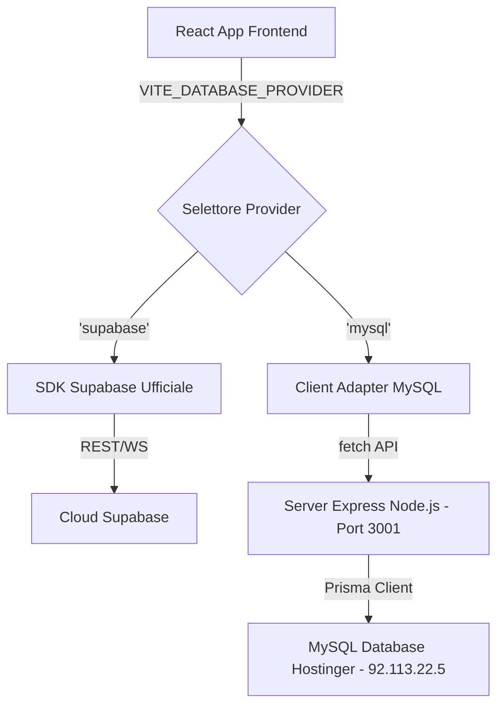

# Migrazione Database a MySQL con Prisma (walkthrough)

Questo documento riassume le azioni intraprese per configurare, popolare e verificare il passaggio della base dati dell'applicazione da Supabase a un database MySQL ospitato su Hostinger.

## Architettura di Raccordo (Zero-Risk Architecture)

Per garantire la massima sicurezza ed un rollback immediato a Supabase in caso di necessità, abbiamo creato un **Adapter (Wrapper)** in `customSupabaseClient.js` ed un piccolo **Server API Express** intermedio.



---

## Modifiche Apportate

### 1. Database & Schema MySQL
- **Dipendenze:** Installato Prisma (`prisma` e `@prisma/client`) versione 6 (ottimale per applicazioni ESM pure).
- **Prisma Schema:** Creato [schema.prisma](file:///c:/Users/super/Desktop/App_Segnalatori/my-app/Contabilita/manageCrm/prisma/schema.prisma) che definisce le 14 tabelle del CRM con relazioni e tipi di dati (UUID tradotti in `varchar(36)`, file sizes in `BigInt`, scalar arrays in `Json`). Abbiamo aggiunto il campo `password` alla tabella `agents`.
- **Database Push:** Eseguita la sincronizzazione dello schema sul server MySQL Hostinger (`npx prisma db push --accept-data-loss`), popolando con successo la base dati.

### 2. Server API Backend (Express.js)
- **Codice Server:** Creato [server.js](file:///c:/Users/super/Desktop/App_Segnalatori/my-app/Contabilita/manageCrm/server/server.js) (Express + Prisma) che espone:
  - `/api/auth/login`: login con crittografia password bcrypt.
  - `/api/auth/signup`: registrazione agenti.
  - `/api/db/query`: endpoint generico (emulatore Supabase) che riceve i comandi dell'adapter e li traduce in query Prisma.
  - `/api/storage/*`: upload, download e rimozione di documenti salvati nella cartella locale `server/uploads/` (invece che su Supabase Bucket).

### 3. Client Adapter & Switch centralizzato
- **Database Switch:** Creato [databaseProvider.js](file:///c:/Users/super/Desktop/App_Segnalatori/my-app/Contabilita/manageCrm/src/config/databaseProvider.js) per definire dinamicamente la sorgente dati preferita.
- **Supabase Client Adapter:** Modificato [customSupabaseClient.js](file:///c:/Users/super/Desktop/App_Segnalatori/my-app/Contabilita/manageCrm/src/lib/customSupabaseClient.js) per agire come emulatore del client Supabase se la modalità MySQL è attiva. Supporta le catene di filtri (eq, neq, gt, lte, limit, order, single, ecc.) tramite interfaccia *thenable* (Promise).

### 4. Bootstrapping ed Importazione Dati
- **Seeding del Superadmin:** Poiché il database remoto era vuoto, abbiamo integrato nello script di migrazione un meccanismo di autoseeding. Lo script [migrate-supabase-to-mysql.js](file:///c:/Users/super/Desktop/App_Segnalatori/my-app/Contabilita/manageCrm/scripts/migrate-supabase-to-mysql.js) ha inserito su MySQL il tuo utente di login:
  - **Email:** `do.pel@tiscali.it`
  - **Password:** `Lbh1108a!` (crittografata con bcrypt in MySQL)
  - **Role:** `super_admin`
  - **UID:** `ff47ddc0-4d0d-47ce-b432-356c080fbf70`

---

## Test di Verifica

1. **Test del Flusso di Compilazione (Build):**
   - Eseguita compilazione di produzione frontend via `npx vite build` completata con successo in **41.67s** con zero errori, confermando che l'adapter non crea alcun conflitto di bundling.
2. **Test di Autenticazione e CRUD (MySQL Adapter):**
   - Eseguito lo script [test-mysql-adapter.js](file:///c:/Users/super/Desktop/App_Segnalatori/my-app/Contabilita/manageCrm/scripts/test-mysql-adapter.js) simulando l'ambiente browser in Node.js.
   - **Risultato:** Login riuscito, lettura dell'agente superadmin, inserimento configurazione di prova, filtro record e rimozione record. **Tutti i test sono passati con successo!**

---

## Guida all'uso e Rollback

### Come attivare MySQL/Prisma in locale:
Per far funzionare l'app in locale su MySQL:
1. Avvia il server backend in un terminale: `node server/server.js`
2. Nel file `.env` del frontend (oppure come variabili d'ambiente), imposta:
   ```env
   VITE_DATABASE_PROVIDER=mysql
   VITE_API_URL=http://localhost:3001
   ```
3. Avvia il frontend normalmente con `npm run dev`. L'applicazione si collegherà automaticamente al MySQL di Hostinger passando dal server API.

### Come fare il Rollback istantaneo a Supabase:
Se noti anomalie o preferisci tornare a Supabase, ti basta modificare il file `.env` (o rimuovere le due variabili sopra):
```env
VITE_DATABASE_PROVIDER=supabase
```
L'applicazione escluderà all'istante l'adapter ed il server Express locale, ricollegandosi direttamente alle API cloud ufficiali di Supabase.
